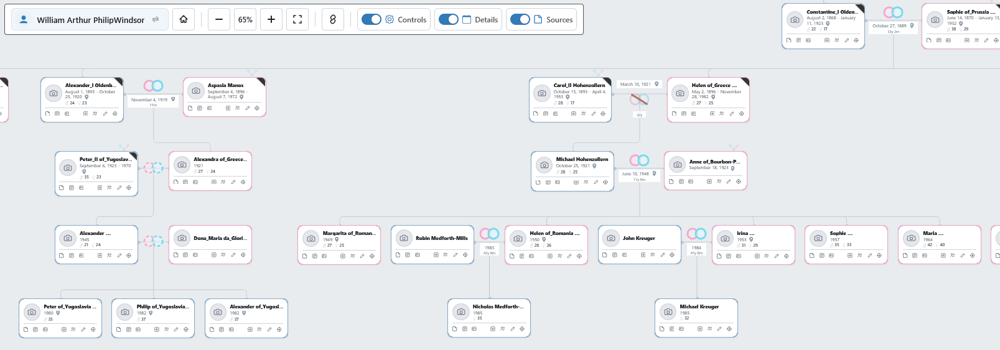

# SP Tree Explorer

[](https://github.com/szporwolik/webtrees-tree-explorer/releases)
[](https://github.com/fisharebest/webtrees)
[](https://github.com/szporwolik/webtrees-tree-explorer/releases)
[](https://www.gnu.org/licenses/gpl-3.0)

An interactive family tree explorer for [webtrees](https://webtrees.net/) — the leading open-source genealogy application.

Built to deliver a clean, modern card-based UI that feels cohesive and powerful for exploring multi-generational family trees. This module was inspired by the [webtrees Interactive Tree](https://webtrees.net/) and the excellent [huhwt-xtv](https://github.com/huhwt/huhwt-xtv) plugin by [huhwt](https://github.com/huhwt). The goal was to create a convenient and familiar genealogy visualization for people used to popular web genealogy platforms, combining modern UI design with powerful navigation features.

Repo: https://github.com/szporwolik/webtrees-tree-explorer

## Author

Szymon Porwolik — [szymon.porwolik.com](https://szymon.porwolik.com/)

## Features

• Appears in the **Diagrams** menu as "Tree Explorer"  
• Drag-and-pan canvas for exploring large trees  
• Expand / collapse branches with click  
• Center on root person  
• Fullscreen toggle  
• Gender-coded card borders (blue = male, pink = female)  
• **Search dropdown** to find and navigate to any person in the tree  
• **Multiple marriages support** — all spouses and children from all marriages displayed  
• **Unknown parent placeholders** — when siblings exist but parents don't, synthetic "?" boxes are created  
• **Source / note / media badges and quick actions** on person and family cards  
• **Configurable default view settings** for details, sources, and advanced controls  
• Print-friendly styling  
• AJAX-powered lazy loading of tree branches  
• Share link support for direct navigation

## Screenshots



## Installation

1. Download or clone this repository  
2. Copy the folder into your webtrees `modules_v4/` directory  
3. Rename it as you prefer (e.g. `sp_tree_explorer`)  
4. Go to **Control Panel → Modules → Charts** and enable the module  
5. Access via **Diagrams → Tree Explorer** from any individual page

## Requirements

• webtrees 2.x  
• PHP 7.4+  
• Modern web browser with JavaScript enabled

## Translations

Runtime translations are loaded from PHP array files in `resources/lang/`.

Currently included locales:
`cs`, `da`, `de`, `es`, `fr`, `it`, `nb`, `nl`, `pl`, `pt`, `pt-BR`, `ro`, `ru`, `sv`, `tr`, `uk`

English uses the built-in source strings and does not need a separate language file.

## Project Structure

```
├── module.php                      # Entry point (returns module instance)
├── SpTreeExplorer.php              # Main module class
├── SpTreeExplorerHandler.php       # AJAX request handler
├── autoload.php                    # PSR-4 autoloader
├── README.md
├── latest-version.txt
├── screenshots/                    # README images
├── Exceptions/
│   └── NavigatorActionMissing.php
├── Module/
│   └── TreeNavigator/
│       └── FamilyTreeRenderer.php  # JSON tree data generator
├── Traits/
│   └── DiagramChartFeature.php     # Chart menu integration
├── resources/
│   ├── lang/                       # Translation files (PHP arrays, 16 locales)
│   ├── css/
│   │   └── navigator.css           # Complete module stylesheet
│   ├── js/
│   │   └── navigator.js            # Main navigation engine
│   └── views/
│       ├── inject-script.phtml
│       ├── inject-style.phtml
│       └── modules/
│           └── spNavigator/
│               ├── diagram.phtml
│               ├── settings.phtml
│               └── viewport.phtml
```

## Dependencies

**Core:**  
• webtrees 2.x — Genealogy application framework (GPL v3)  
• Uses webtrees API: `Individual`, `Family`, `Tree`, `Auth`, `Registry`, `I18N`, etc.

**JavaScript:**  
• ES5 JavaScript — no external frameworks required  
• Uses standard browser APIs: Canvas, XMLHttpRequest, DOM manipulation

## Roadmap / Future Features

• **PNG export** — Diagram export to image file (planned for future release)

## Contributing

This is a personal project. Issues are welcome, and pull requests are accepted — please open them against the `dev` branch.

## Releases

A GitHub Actions workflow (`.github/workflows/release.yml`) automates the release process. Before triggering it:

1. Update the version in **`latest-version.txt`** (plain version number, e.g. `0.7.4`).
2. Update the **`customModuleVersion()`** return value in `SpTreeExplorer.php` to the same version.
3. Run the **Create Release** workflow from the Actions tab — it builds a ZIP archive and creates a tagged GitHub release with auto-generated notes from merged pull requests.

## License

[GPL-3.0-or-later](https://www.gnu.org/licenses/gpl-3.0.html) — same license family as webtrees itself.

Copyright (C) 2025-2026 Szymon Porwolik
